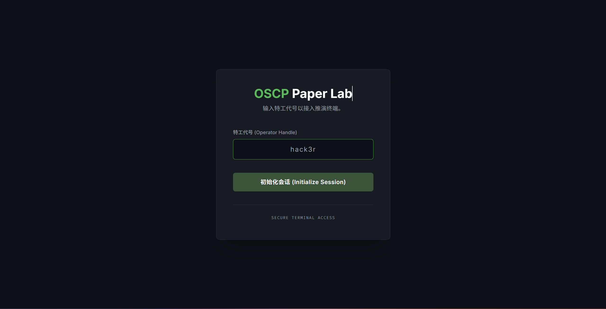
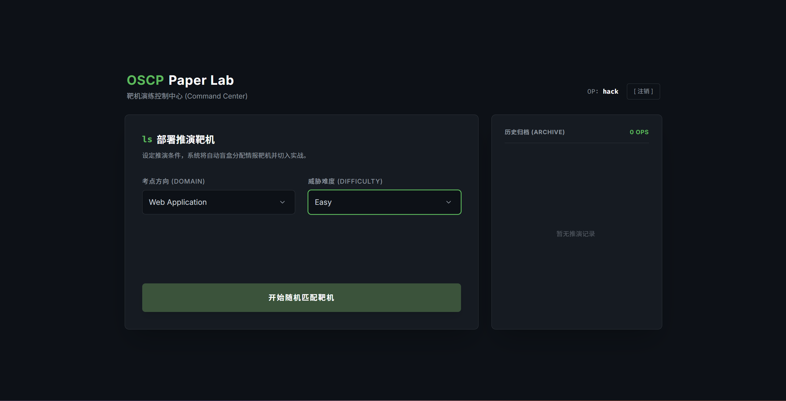
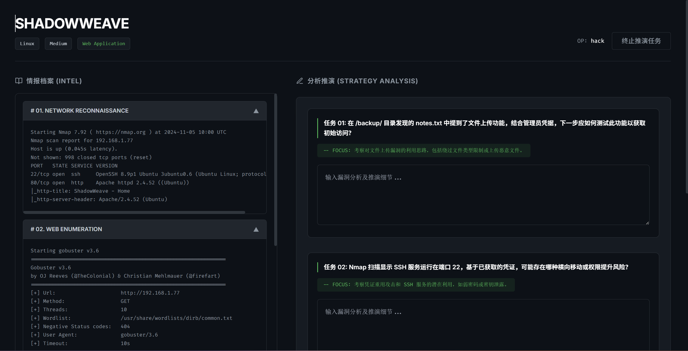
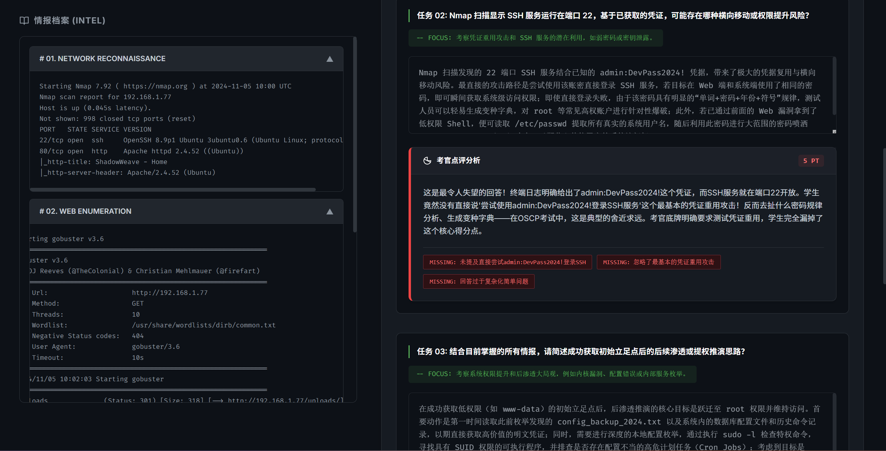
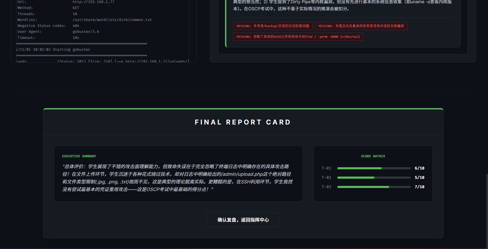

# PaperLab: OSCP 纸上推演靶场生成引擎

> “纸上得来亦不浅，赛博沙盘定乾坤。”


### 项目简介

PaperLab 是一款基于大语言模型 (LLM) 的网络安全纸上推演靶场生成工具。

它的核心逻辑是提取真实的 OSCP/HTB 通关笔记（Markdown 格式），通过特定的 Prompt 工程进行逻辑重构与变异，最终生成具有严密逻辑链的全新虚拟靶机情报，供安全研究员和学生进行**“不插电”**的渗透思路推演。

### 界面预览 (Interface)

首页图：



靶机选择图：



终端推断：



LLM模型批阅：





### 核心特性

* **多维度环境变异 (Context Mutation)**：支持端口替换、入口点变更、提权手法替换、假情报注入（Rabbit Hole）以及 OS 类型反转。基于同一份母体笔记，可生成多条截然不同的攻击路径。
* **高仿真终端日志伪造**：拒绝大白话总结。强制输出纯英文终端原生日志格式（如 Nmap, Gobuster, smbclient 等），并真实还原明文凭据和扫描特征。
* **攻击链无痕截断**：在情报搜集阶段精准截断，保留推演悬念，绝不泄露后续的漏洞利用和提权步骤。
* **LLM 容错与自动重试机制**：针对大模型偶发的 JSON 格式化错误（如特殊字符未转义），底层架构内置了 3 次自愈重试机制，保障批量生成时的代码健壮性。
* **动态靶机命名与防冲突**：内置历史字典黑名单，动态生成类似 `Spectre`, `Obsidian` 等代号，避免数据库记录碰撞与覆写。

### 快速开始


本项目自带一个包含示例靶机的 `paperlab.db`，需要自行在`mian.py`配置**DeepSeek API**即可直接运行体验：

### 1. 启动 Demo 终端
```bash
uvicorn main:app --reload main.py
```

随后在浏览器中访问 `127.0.0.1:8000`，输入任意Nick Name代号即可接入推演终端。

### 2. 生成自定义靶机

如需接入自己的 Markdown 笔记并生成全新题库：

1. 将现有的渗透测试笔记（`.md` 格式）放入 `md/` 目录。
2. 打开 `build.py`配置你自己的 DeepSeek API Key并运行

```
python build.py
```

### 开源协议与商业声明

本项目由 `cxtw1t` 独立开发并维护。核心 Prompt 工程与重试机制逻辑未经授权严禁商用。

本项目基于 **[GPLv3 License](https://www.google.com/search?q=LICENSE)** 开源。

### 鸣谢与免责声明 

本项目 `md/` 目录中内置的推演母体样本（Demo 笔记），源自优秀安全研究员的开源分享：**[cyb0rg-se/OSCP-notes](https://github.com/cyb0rg-se/OSCP-notes)**。 * 

**特此致敬**原作者在网安社区的无私开源。PaperLab 仅将其作为大模型变异算法的输入样本进行学术层面的推演测试，原始笔记的知识产权完全归原作者所有。 

* **We respect the code, and we respect the community.**
