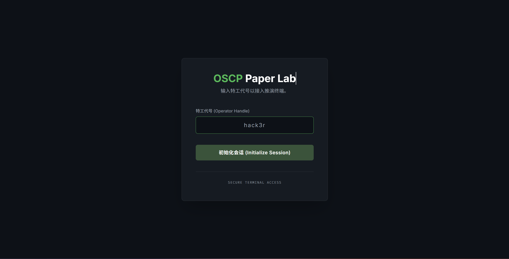
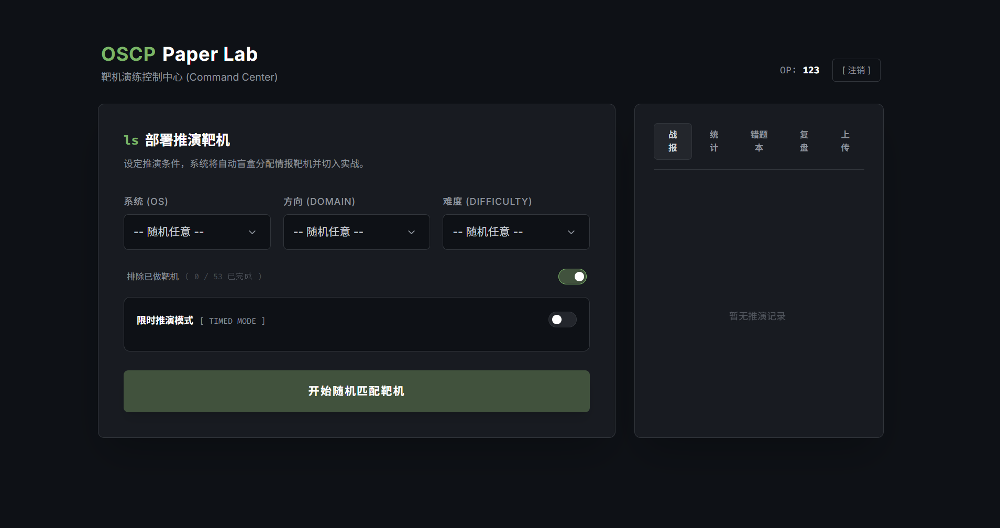
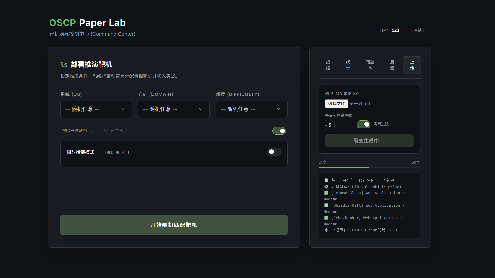
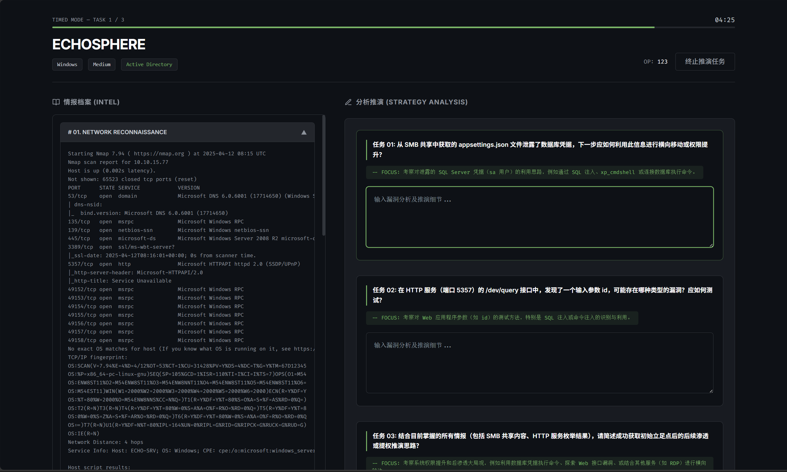
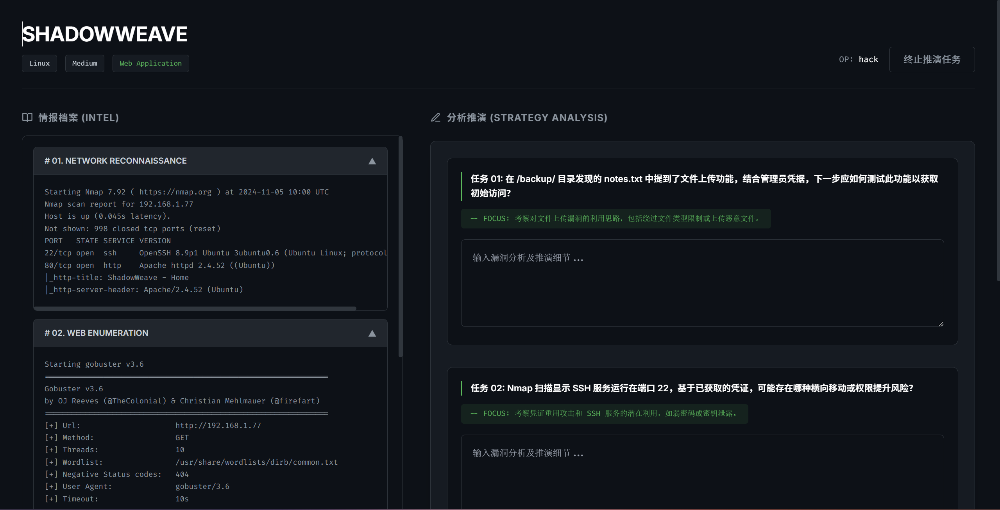
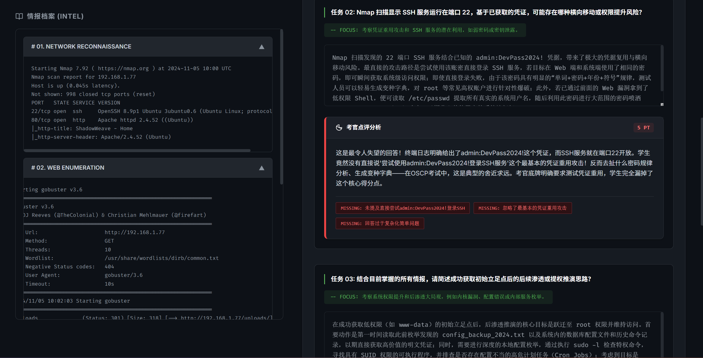
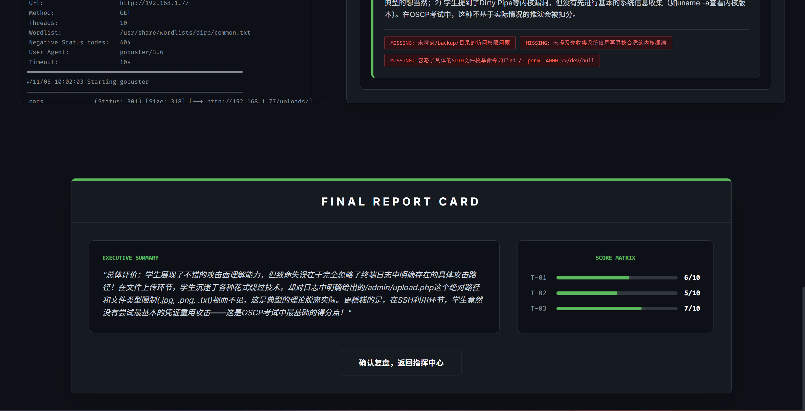

# PaperLab: OSCP 纸上推演靶场

> "纸上得来亦不浅，赛博沙盘定乾坤。"


### 项目简介

PaperLab 是一款基于大语言模型 (LLM) 的网络安全纸上推演靶场生成工具。

它的核心逻辑是提取真实的 OSCP/HTB 通关笔记（Markdown 格式），通过特定的 Prompt 工程进行逻辑重构与变异，最终生成具有严密逻辑链的全新虚拟靶机情报，供安全研究员和学生进行**"不插电"**的渗透思路推演。

### 界面预览

首页图：



靶机选择界面：



自定义上传裂变界面:



限时挑战：



正常挑战：



LLM模型批阅：





### 核心特性

* **多维度环境变异 (Context Mutation)**：支持端口替换、入口点变更、提权手法替换、假情报注入（Rabbit Hole）以及 OS 类型反转。基于同一份母体笔记，可生成多条截然不同的攻击路径。
* **高仿真终端日志伪造**：拒绝大白话总结。强制输出纯英文终端原生日志格式（如 Nmap, Gobuster, smbclient 等），并真实还原明文凭据和扫描特征。
* **攻击链无痕截断**：在情报搜集阶段精准截断，保留推演悬念，绝不泄露后续的漏洞利用和提权步骤。
* **SM-2 间隔重复复盘**：基于 SM-2 算法根据答题质量自动调度复盘间隔，支持卡片式作答与三档自评（不会 / 模糊 / 掌握），精准攻克薄弱考点。
* **LLM 容错与自动重试机制**：针对大模型偶发的 JSON 格式化错误，底层架构内置了 3 次自愈重试机制，保障批量生成时的健壮性。
* **动态靶机命名与防冲突**：内置历史字典黑名单，动态生成类似 `Spectre`, `Obsidian` 等代号，避免数据库记录碰撞与覆写。
* **Domain 分类 + Difficulty 三档**：每台靶机自动归类至 Web、Active Directory、Privilege Escalation 等安全领域，并标注 Easy / Medium / Hard 难度，支持前端多维度筛选。
* **错题本系统**：用户可将答错或薄弱的考题一键收藏，随时回顾考官评语与核心知识点；支持一键导出为 Markdown 文件离线复习。
* **个人统计面板**：自动汇总历史战报，按 Domain / Tag 维度输出平均得分趋势图，精准定位技术短板。
* **全平台排行榜**：实时聚合所有用户的平均分与推演次数，按综合排名展示，适合团队共同训练竞技。
* **并发靶机生成**：批量编译时支持多线程并发调用 LLM，速度提升约 3 倍；同时支持 CLI 参数灵活控制编译目标、变种数和线程数。
* **多用户隔离**：支持多人共用同一服务实例，历史战报、错题本与统计数据均按 Nick Name 独立隔离。

### 快速开始

本项目自带一个包含示例靶机的 `paperlab.db`，三步即可上手：

#### 第一步：安装依赖

```cmd
python -m pip install -r requirements.txt
```

#### 第二步：初始化配置

运行安装向导，按提示填入 API Key、选择模型和服务端点（支持 DeepSeek / OpenAI / 自定义）：

```cmd
python setup.py
```

向导完成后会自动生成 `config.json`

#### 第三步：启动服务

```cmd
uvicorn main:app --reload
```

随后在浏览器中访问 `http://127.0.0.1:8000`，输入任意 Nick Name 代号即可接入推演终端。

---

### 生成自定义靶机

有两种方式扩充题库：

**方式一：命令行批量编译**

1. 将渗透测试笔记（`.md` 格式）放入 `md/` 目录。
2. 确认已完成 `python setup.py` 配置。
3. 运行编译器：

```cmd
# 全量编译（每份笔记默认裂变 3 个变种）
python build.py

# 只编译指定靶机，生成 5 个变种，开启质量过滤
python build.py --target HTB-Lame HTB-Blue --derive 5 --quality

# 5 线程并发加速，最多处理 20 台源机器
python build.py --workers 5 --max-sources 20
```

> 完整参数说明：`python build.py --help`

**方式二：前端在线上传**

在指挥中心右侧面板切换到「上传」Tab，直接上传 `.md` 文件，通过 SSE 实时查看每台靶机的生成进度，无需登录服务器。

---

### 文件结构

```
PaperLab-1.0/
├── main.py           # FastAPI 后端主程序（API 服务 + 判卷引擎）
├── build.py          # 靶机编译器（LLM 变异生成 + 写入 DB）
├── lab_generator.py  # 共用 LLM 生成逻辑（build.py 与 main.py 共享）
├── setup.py          # 首次部署配置向导
├── index.html        # 前端单页应用
├── requirements.txt  # Python 依赖
├── paperlab.db       # SQLite 数据库（靶机库 + 战报 + 错题本）
├── config.json       # 本地配置（API Key，由 setup.py 生成）
└── md/               # 渗透测试 Markdown 笔记目录（编译原料）
```

---

### 开源协议与商业声明

本项目由 `cxtw1t` 独立开发并维护。核心 Prompt 工程与重试机制逻辑未经授权严禁商用。

本项目基于 **[GPLv3 License](https://www.google.com/search?q=LICENSE)** 开源。

### 鸣谢与免责声明

本项目 `md/` 目录中内置的推演母体样本（Demo 笔记），源自优秀安全研究员的开源分享：**[cyb0rg-se/OSCP-notes](https://github.com/cyb0rg-se/OSCP-notes)**。

**特此致敬**原作者在网安社区的无私开源。PaperLab 仅将其作为大模型变异算法的输入样本进行学术层面的推演测试，原始笔记的知识产权完全归原作者所有。

**We respect the code, and we respect the community.**

