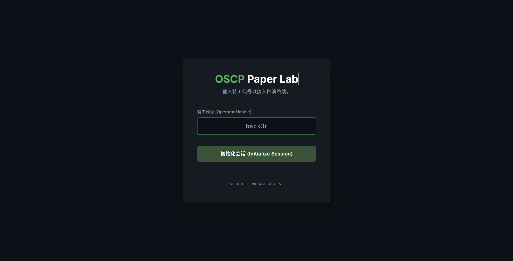
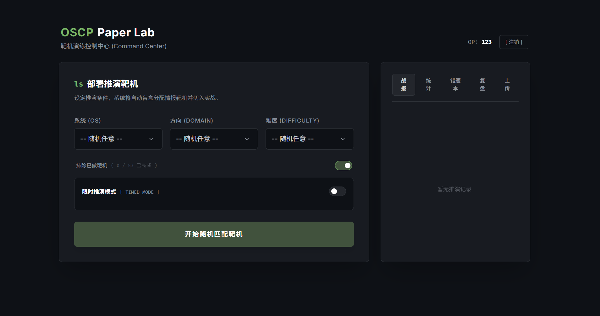
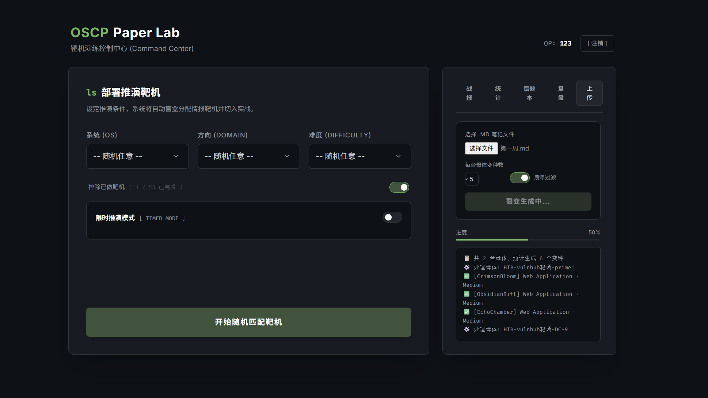
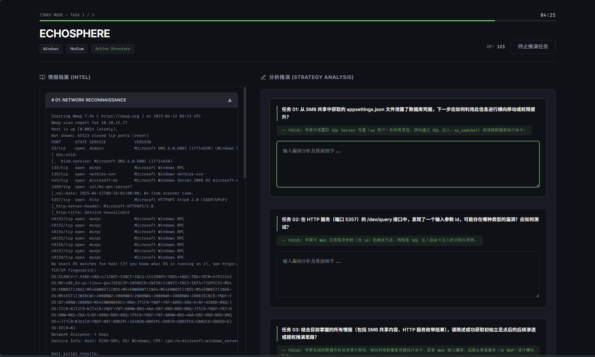
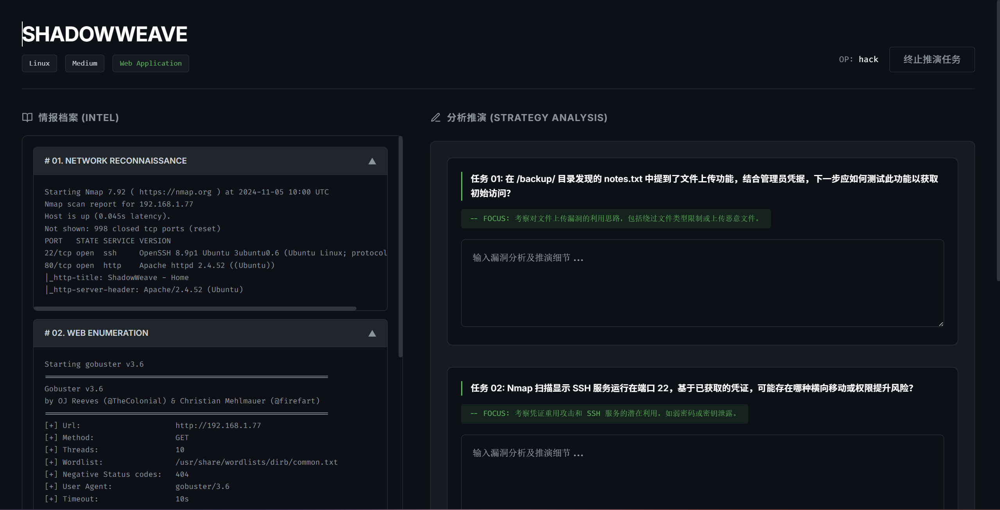
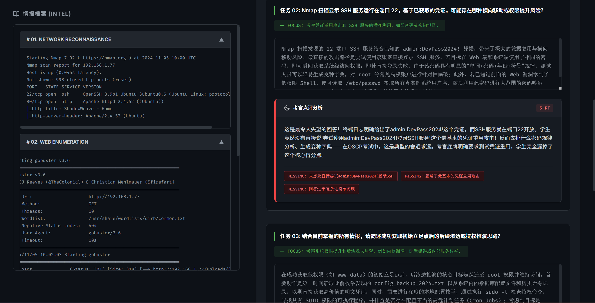
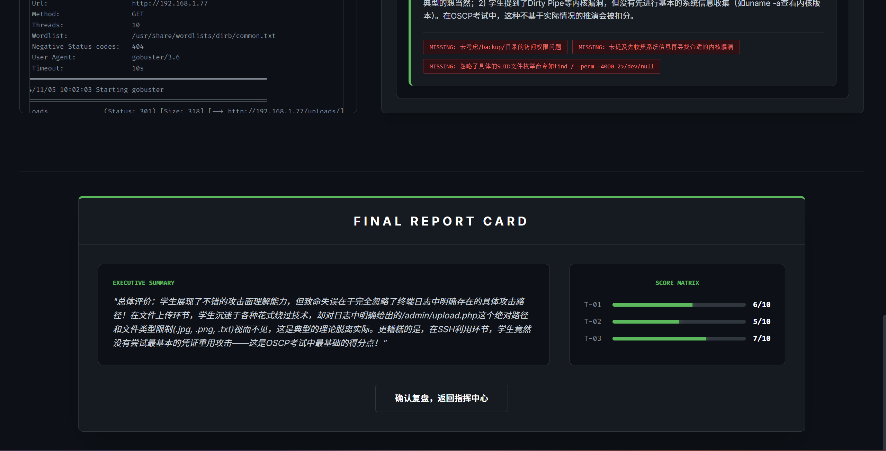

# PaperLab: OSCP 纸上推演靶场

> "纸上得来亦不浅，赛博沙盘定乾坤。"


### 项目简介

PaperLab 是一款基于大语言模型 (LLM) 的网络安全纸上推演靶场生成工具。

它的核心逻辑是提取真实的 OSCP/HTB 通关笔记（Markdown 格式），通过特定的 Prompt 工程进行逻辑重构与变异，最终生成具有严密逻辑链的全新虚拟靶机情报，供安全研究员和学生进行**"不插电"**的渗透思路推演。

### 界面预览

首页图：



靶机选择界面：



自定义上传裂变界面:



限时挑战：



正常挑战：



LLM模型批阅：





### 核心特性

**靶机生成**

* **多维度环境变异**：支持端口替换、入口点变更、提权手法替换、假情报注入（Rabbit Hole）以及 OS 类型反转。基于同一份母体笔记，可生成多条截然不同的攻击路径。
* **高仿真终端日志伪造**：拒绝大白话总结，强制输出纯英文的终端原生日志格式（Nmap、Gobuster、smbclient 等），并真实还原明文凭据与扫描特征。
* **攻击链无痕截断**：在情报搜集阶段精准截断，保留推演悬念，绝不泄露后续的漏洞利用与提权步骤。

**训练闭环**

* **推演作答 + AI 批阅**：以资深考官视角结合终端日志与预期攻击链评分，明确指出遗漏的核心知识点。
* **SM-2 间隔重复复盘**：卡片式作答与三档自评（不会 / 模糊 / 掌握），按答题质量自动调度复习间隔，攻克薄弱考点。
* **错题本**：一键收藏答错或薄弱的题目，随时回顾考官评语，支持导出 Markdown 离线复习。
* **统计与排行榜**：按 Domain / Tag 维度输出得分趋势以定位短板，支持多维度筛选；全平台排行榜适合团队共同训练。

**使用与部署**

* **批量生成靶机**：命令行与网页上传均支持多线程并发，可灵活控制编译目标、变种数与线程数。
* **代号隔离（可选口令）**：默认按代号隔离、零门槛即用；需要更强隔离时，为该代号设置访问口令即可开启保护。
* **可离线运行**：前端框架本地化并锁定版本，无外网也能打开与操作。

### 快速开始

本项目自带一个包含示例靶机的 `paperlab.db`，三步即可上手：

> 该示例库为演示数据，含 53 台靶机，不含任何用户战报 / 错题本 / 复习进度。
> 用 `build.py` 添加自己的笔记时，这 16 台已编译的母体会被自动跳过，不会重复生成。

#### 第一步：安装依赖

```cmd
python -m pip install -r requirements.txt
```

#### 第二步：初始化配置

运行安装向导：填入 API Key、选择服务端点，向导会**列出该端点当前可用的模型**供你选择
（内置 DeepSeek / OpenAI / 智谱 GLM / xAI Grok / Anthropic Claude，也可自定义端点；
列不到时可手动输入模型名）：

```cmd
python setup.py
```

向导完成后会自动生成 `config.json`

#### 第三步：启动服务

```cmd
python main.py
```

随后在浏览器中访问 `http://127.0.0.1:8000`，输入任意代号即可接入推演终端。

> 需要**开发热重载**或**局域网共享**时，改用 uvicorn 自行传参：
> `uvicorn main:app --reload`、`uvicorn main:app --host 0.0.0.0`
> （局域网共享还需设置 `PAPERLAB_ORIGINS`，见下方「环境变量」）。

---

### 生成自定义靶机

有两种方式扩充题库：

**方式一：命令行批量编译**

1. 将渗透测试笔记（`.md` 格式）放入 `md/` 目录。
2. 确认已完成 `python setup.py` 配置。
3. 运行编译器：

```
$ python build.py

  ____                        _           _
 |  _ \ __ _ _ __   ___ _ __| |    __ _| |__
 | |_) / _` | '_ \ / _ \ '__| |   / _` | '_ \
 |  __/ (_| | |_) |  __/ |  | |__| (_| | |_) |
 |_|   \__,_| .__/ \___|_|  |_____\__,_|_.__/
             |_|
  ██████╗ ██╗   ██╗██╗██╗     ██████╗
  ██╔══██╗██║   ██║██║██║     ██╔══██╗
  ██████╔╝██║   ██║██║██║     ██║  ██║
  ██╔══██╗██║   ██║██║██║     ██║  ██║
  ██████╔╝╚██████╔╝██║███████╗██████╔╝
  ╚═════╝  ╚═════╝ ╚═╝╚══════╝╚═════╝
  Lab Compiler  -  Mutate. Derive. Pwn.
  author: tw1t   https://github.com/cxtwit/PaperLab

  用法:
    python build.py [参数]

  参数:
    --target  <ID> [ID ...]   只编译指定母体机器，如 HTB-Lame HTB-Blue
    --derive  <N>             每台母体生成的变种数（默认: 3）
    --workers <N>             并发线程数，建议不超过 5（默认: 3）
    --max-sources <N>         最多处理的源机器数量（默认: 50）
    --quality                 启用质量过滤，额外消耗一次 LLM 调用
    --force                   忽略「已编译」记录，强制重新编译
    -h, --help                显示帮助信息

  示例:
    python build.py --derive 3                            # 全量编译，生成 3 个变种
    python build.py --target HTB-Lame HTB-Blue            # 只编译指定靶机
    python build.py --derive 5 --workers 5 --quality      # 5 线程 + 质量过滤
    python build.py --max-sources 10 --derive 2           # 最多 10 台，每台 2 变种
    python build.py --force --target HTB-Lame             # 强制重编译某台
```

**方式二：前端在线上传**

在指挥中心右侧面板切换到「上传」Tab，直接上传 `.md` 文件，通过 SSE 实时查看每台靶机的生成进度，无需登录服务器。

---

### 文件结构

```
PaperLab-1.0/
├── main.py           # FastAPI 后端主程序（API 服务 + 判卷引擎）
├── build.py          # 靶机编译器（LLM 变异生成 + 写入 DB）
├── lab_generator.py  # 共用 LLM 生成逻辑（build.py 与 main.py 共享）
├── setup.py          # 首次部署配置向导
├── index.html        # 前端单页应用
├── static/           # 本地静态资源（已本地化并锁版本的 Vue）
├── requirements.txt  # Python 依赖
├── paperlab.db       # SQLite 数据库（靶机库 + 战报 + 错题本）
├── config.json       # 本地配置（API Key，由 setup.py 生成）
├── LICENSE           # Apache License 2.0
└── md/               # 渗透测试 Markdown 笔记目录（编译原料）
```

---

### 环境变量

| 变量 | 默认 | 说明 |
|---|---|---|
| `PAPERLAB_ORIGINS` | `http://127.0.0.1:8000,http://localhost:8000` | 允许跨域的来源。局域网共享时需显式声明，例如 `http://192.168.1.10:8000` |
| `PAPERLAB_ENABLE_DOCS` | `0` | 设为 `1` 打开 `/docs` 与 `/openapi.json` 接口文档 |
| `PAPERLAB_DB` | `paperlab.db` | 自定义数据库路径 |

---

### 代号隔离

默认情况下，输入任意代号即可接入，代号之间按名字隔离数据 —— 适合个人使用或小团队共享。

如果某个代号需要更强隔离，**在登录时给它填一个口令即可开启保护**（首次填入即生效）；之后再用该代号接入就必须提供正确口令。填口令的人请自行记好：服务端只存哈希，无法找回。

> 提示：口令仅保存在浏览器会话中（`sessionStorage`），关闭浏览器后需要重新输入。

---

### 开源协议

本项目基于 **[Apache License 2.0](./LICENSE)** 开源，由 `tw1t` 独立开发并维护。

### 鸣谢与免责声明

本项目 `md/` 目录中内置的推演母体样本（Demo 笔记），源自优秀安全研究员的开源分享：**[cyb0rg-se/OSCP-notes](https://github.com/cyb0rg-se/OSCP-notes)**。

**特此致敬**原作者在网安社区的无私开源。PaperLab 仅将其作为大模型变异算法的输入样本进行学术层面的推演测试，原始笔记的知识产权完全归原作者所有。

**We respect the code, and we respect the community.**

